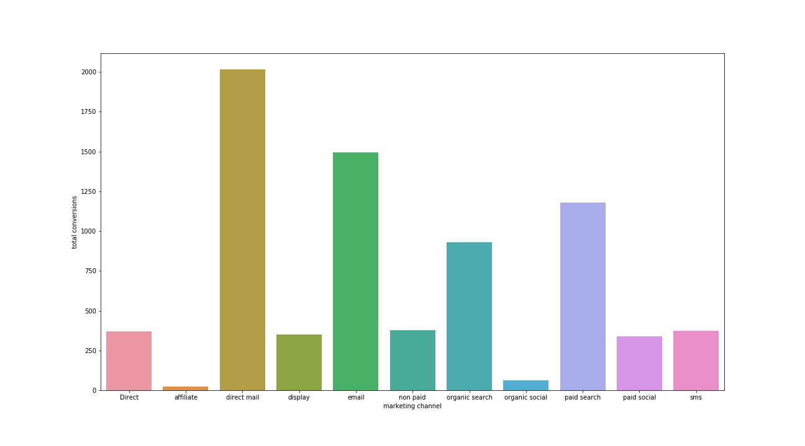
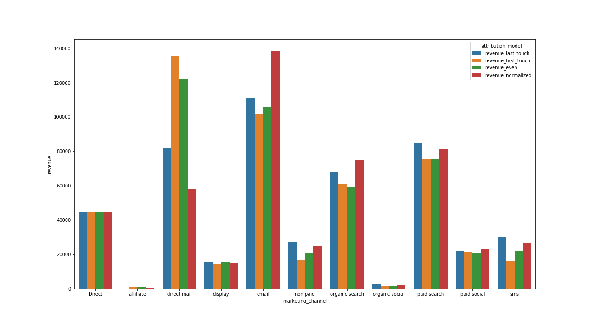
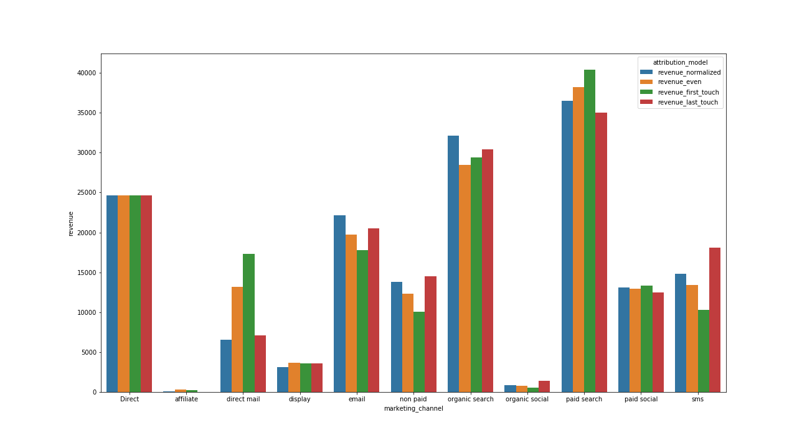

# Rockerbox Technical Implementation Associate Prompt
## David Miller

## Question 1
* By shear number of conversions by event type, direct mail, email, paid search and organic search are performing the best in that order:

* Even though those categories are still tops by revenue, when looking at various attribution models, the order and amount generated changes drastically:

* It depends on the model you're looking at, but overall email is the strongest. Direct mail looks strong in every model except what is likely the best in normalized.
* These differences mean that each channel type has a higher likelihood of being at some point in the marketing journey than others (for example direct mail is much more likely to be a last touch than first).

## Question 2
a) Below is a chart of average time to convert after interating with each channel:

b/c) The most common paths are single touch points, but excluding those the most common is two direct mails. For more details, see the notebook.

## Question 3
* To answer this question, we want to look at revenue generated by new customers by channel:

* Looking at touchpoints that led to the highest number of new users, email and paid search would be the best to invest in. However, it is difficult to make a confident recommendation without knowing the cost of each paid channel in order to calculate ROI/ROAS.

## Bonus
* After removing organic touchpoints, SMS performs quite well followed by paid search and direct mail.
